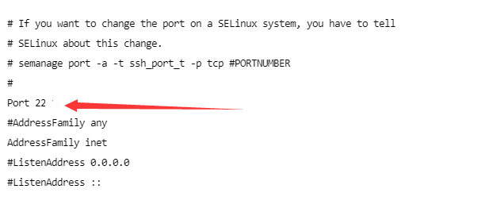
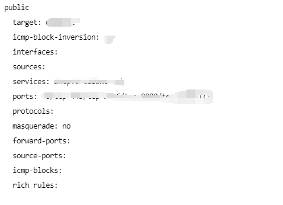

## 起因

在服务被入侵过一次之后,虽然使用了`fail2ban`去拦截了撞密码的ip,但是每天还有大量的扫描....

这是由于服务器的`ssh`连接使用了默认端口22,这是全世界人都知道的端口号,所以就非常容易被撞.

## 修改ssh端口

修改ssh端口通过修改配置文件实现,在进入服务器后:(需要root权限)

```
vi /etc/ssh/sshd_config
```

找到:



如果`Port`前面有`#`就把`#`去掉,修改这个值为你想要的值

输入新的端口号如：Port 9292**（这个你自己定，最大不能超过65535）**

编辑好之后`:wq`保存退出

## 重启ssh服务

修改完配置文件之后,需要重启服务才能生效:

```
systemctl restart sshd.service
```

到这一步重启成功之后,如果没有防火墙的限制应该就能用新端口进行ssh链接了.

## 防火墙端口放行

我使用的是`firewall-cmd`,使用下面命令查看现在的放行端口:

```
sudo firewall-cmd --list-all
```



添加刚刚添加的端口:

```
sudo firewall-cmd --add-port=9292/tcp
```

更新配置:

```
sudo firewall-cmd --reload
```

**大功告成**!

