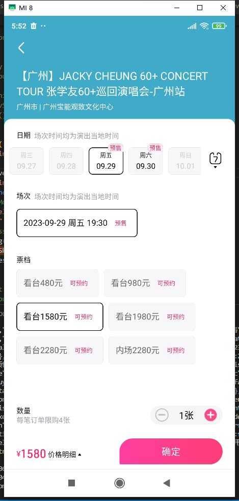

# 起因

疫情开放第一年的演出市场彻底疯掉，五月天北京鸟巢完全抢不到，黄牛猖狂加价，恶心羞辱真五迷，气愤无奈情绪无从发泄。

一气之下决定研究一下某麦app接口。


# 逆向信息

平台：Android

app版本：8.4.5

工具:jadx,frida


# 思路

其实想法很简单，一共两个方向

1. 在app中，等待开票提前进入选择界面或者付款界面，这样可以一定程度上比普通用户快一掉掉
2. 实现程序call api生成订单，这是最终目的


# APP源码分析

## 倒计时去除

从界面上看，待开售的页面和立即购买页面是的却别是开售倒计时，从开发估计一定是会通过api获取开售时间，在前端进行倒计时。


通过抓包得知获取详情的api是：

```
https://acs.m.taobao.com/gw/mtop.alibaba.damai.detail.getdetail/1.2/
```

返回结构：

```
{
	"api": "mtop.alibaba.damai.detail.getdetail",
	"data": {
		"result": "......"
	},
	"ret": [
		"SUCCESS::调用成功"
	],
	"v": "1.2"
}
```

其中`data.result`就是演出的detail数据:


猜测`sellStartTime`就是开始时间,用`countDown`作倒计时.尝试在APP源码中查找


找到一个叫做`ProjectItemDataBean`的类,看一下这个`DataBean`用来做什么


继续查找`countDown`的用例


发现了`ProjectDetailItemMainFragment`,应该是View层了,查看是怎么使用


从api 返回知道`countdown`返回的值是`591614`, 估计是秒数,所以hook一下测试:

```
let ProjectItemDataBean = Java.use(
  "cn.damai.trade.newtradeorder.ui.projectdetail.projectdetailitem.bean.ProjectItemDataBean"
);

ProjectItemDataBean["setCountDown"].implementation = function (j) {
  console.log(`ProjectItemDataBean.setCountDown is called: j=${j}`);
  if (j > 1) {
    this["setCountDown"](5);
  } else {
    this["setCountDown"](0);
  }
};
```

直接把`countDown`设成5秒以内,效果是成功的


但是即便是倒计时小时了显示立即购买,点击立即购买按钮依然是没办法进入选择价钱页面,为什么呢?

于是我尝试查找倒计时结束之后的逻辑,在View层有一个`TimeCountDownListener`lim


这里是更新了`BuyBtnText`,还更新了` this.mProjectItemStatusHelper.m45526u(this.mProjectItemDataBean);`,所以估计在点击`立即购买`按钮还有其他数据的判断.


这是通过阅读代码发现有一个类叫做`ProjectItemStatusHelper.OnBottomViewClickListener`,里面的函数:

```
    public interface OnBottomViewClickListener {
        void onBuyRightNow(int i);

        void onNeedPrivilege(int i);

        void onRegister(int i);

        void onSelectSeat();

        void onSoldOut();

        void onTimingCountDown();
    }


```

在`ProjectDetailitemMainFragment`中的实现是:

```
public class C4295e0 implements ProjectItemStatusHelper.OnBottomViewClickListener {
        private static transient /* synthetic */ IpChange $ipChange;

        C4295e0() {
            ProjectDetailItemMainFragment.this = r1;
        }
		...
		...
		...
        @Override // 
        public void onTimingCountDown() {
            IpChange ipChange = $ipChange;
            if (AndroidInstantRuntime.support(ipChange, "-926618722")) {
                ipChange.ipc$dispatch("-926618722", new Object[]{this});
            } else {
                ProjectDetailItemMainFragment.this.processTimeCountDownClick();
            }
        }
    }

```

通过分析`processTimeCountDownClick`可知道:

```
processTimeCountDownClick()->processClickNotRefreshAfterCountDown()->getSubProjectDectailCheckData()
```

最终调用`skuRequest`再次call api获取数据:


在`ProjectDetailItemMainFragment.onReturnSkuBeanDataSuccess()`中可以看到,原来点击按钮之后会再次获取`skuBean`,然后判断里面的`itemBuyBtnBean.btnStatus`是否等于106和倒计时是否等于0,最终运行`popupSkuByPerformInfo()`

```
public void onReturnSkuBeanDataSuccess(SkuBean skuBean) {
        long j;
        ...
        ...
        int i = itemBuyBtnBean.btnStatus;
        if (i != 230 && i != 231) {
            this.mSkuBean = skuBean;
        } else {
            this.mSkuBean = null;
        }
        ...
        ...
        if (itemBuyBtnBean.btnStatus == 106) {
            ...
            ...
        }
        updateCountDownVisibility(false, false);
        updateMemberPromptCountDownVisibility(false, false);
        ProjectItemStatusHelper projectItemStatusHelper2 = this.mProjectItemStatusHelper;
        if (projectItemStatusHelper2 != null) {
            projectItemStatusHelper2.m45526u(this.mProjectItemDataBean);
            updatePageUT();
            if (!this.mProjectItemStatusHelper.m45535l()) {
                cancelCountDown();
                displayProjectNotExistPage();
                return;
            }
            this.mPurchaseType = -1;
            popupSkuByPerformInfo();
        }
    }

```

通过其他正常可购买的api返回得知,"立即购买"的`status`是`204`,所以,我们可以通过抓包或者hook修改`skubean`中`itemBuyBtnBean.btnStatus`为`204`.

我是通过Hook修改:

```
C42703["onSuccess"].overload(
  "cn.damai.commonbusiness.seatbiz.sku.qilin.bean.SkuBean"
).implementation = function (skubean) {
  var result = updateSkuBean(skubean);
  this["onSuccess"](result);
};
function updateSkuBean(skubean) {
  var json = Java.use("com.alibaba.fastjson.JSON");
  var a = JSON.parse(json["toJSONString"](skubean));
  a.itemBuyBtn.btnStatus = 204;
  var result = json["parseObject"](JSON.stringify(a), skubean.getClass());
  return result;
}
```

如果一切正常最后会运行`openSkuActivity()`进入到下一个选购界面


## 显示购买按钮

然而进入了选择场次票档界面,底部的按钮依然是"提交开售提醒",不是立即购买,这里继续看下有无办法Hook一下


通过观察,如果是可购买状态的话会显示数量和总价,再有确定按钮.

思路还是从api入手,通过分析如果点解了购买按钮会call一个`buildorder`的api:`https://mtop.damai.cn/gw/mtop.trade.order.build/4.0/`

经过查找,锁定call api的类是`DMOrderBuildRequest`


从`openSkuActivity()`可以知道选择票档页面是`NcovSkuActivity`,沿着这方向一直定位到`NcovSkuFragment.updateAllview`

```
NcovSkuActivity->NcovSkuFragment->initData->updateAllview->this.mModel.getSkuBean().observe
```

每次`skuBean`有更新都会`updateAllview`一次.

而其中有一个`this.skuBottomInfo`,结合界面动作,只有点击了票档才会出现底部的操作栏,所以猜测这里是底部确认按钮显示的关键


继续往下看有一个叫做`this.mSelectedPerform = this.mSkuBean.perform;`的变量,应该就是选择了的票档.查找一下`mSelectedPerform`的引用


发现了`mSkuBottomView`,感觉距离终点越来越近了(`MMSkuBottomView`是我起的别名)


接下来分析`mSkuBottomView`的基类:


这个类就看得比较困难了,都是混淆后的名字,不过还好有中文哈哈哈,

其中一个函数叫`h()`找到想要的答案(我重命名为`buyBottomUI`):


其中用作判断的`this.f40114o`就是`NcovSkuBottomInfo`.

经过完整的分析,最后确定只要修改`skubean`的api返回值,就能令到确认购买按钮显示.

以下是hook代码:

```
C42703["onSuccess"].overload(
  "cn.damai.commonbusiness.seatbiz.sku.qilin.bean.SkuBean"
).implementation = function (skubean) {
  console.log("C42703.onSuccess is called:" + skubean);
  console.log("class:" + skubean.getClass());
  // console.log('class:' + skubean.itemBuyBtn.btnStatus);

  showJavaObjectString(skubean);
  var result = updateSkuBean(skubean);

  this["onSuccess"](result);
};
function updateSkuBean(skubean) {
  var json = Java.use("com.alibaba.fastjson.JSON");
  var a = JSON.parse(json["toJSONString"](skubean));
  console.log("skubean data:" + a);
  console.log("skubean.itemBuyBtn.btnStatus:" + a.itemBuyBtn.btnStatus);
  a.itemBuyBtn.btnStatus = 204;
  a.perform.performSalable = true;
  a.perform.positive = true;
  a.actionControl.renderingControl.renderingType = 1;
  a.perform.skuList.forEach((element) => {
    element.frontEndStatus = 1;
    element.clickable = true;
    element.mq = 100;
  });
  console.log("skubean.itemBuyBtn.btnStatus:" + a.itemBuyBtn.btnStatus);
  var result = json["parseObject"](JSON.stringify(a), skubean.getClass());
  console.log("toJavaObject result:" + result);
  return result;
}
let C20621 = Java.use(
  "cn.damai.commonbusiness.seatbiz.sku.qilin.model.SkuModel$1"
);
C20621["onSuccess"].overload(
  "cn.damai.commonbusiness.seatbiz.sku.qilin.bean.SkuBean"
).implementation = function (skubean) {
  // console.log(`SkuModel..onSuccess is called`);
  console.log("SkuModel..onSuccess called:" + skubean);
  console.log("class:" + skubean.getClass());
  // console.log('class:' + skubean.itemBuyBtn.btnStatus);
  showJavaObjectString(skubean);
  var result = updateSkuBean(skubean);
  this["onSuccess"](result);
};
```

其中hook的函数是`skuRequest.request`的`callback`中的`onSuccess`函数,而不是直接修改api的返回值.

而这样的`onSuccess`一共有两处:`C20621`和`C42703`

这样的话就能在演出未开始正式开售之前,提前进入到选择页面:




虽然如此,也是需要等正式开售了之后才能点击正常进入到订单确认页面,如果提前点击会报错.感觉提前进入的hook到这里已经是极限了,因为订单确认页面是需要调用`buildOrder`成功之后的数据生成的,所以这里开始就要靠运气了


